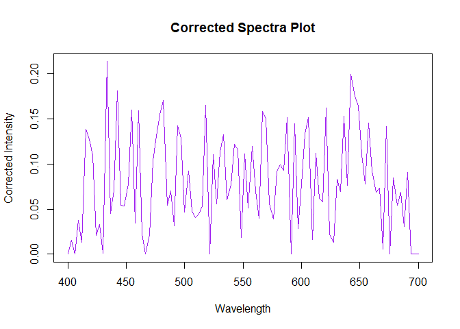

<!-- README.md is generated from README.Rmd. Please edit that file -->

# baselinedetection

<!-- badges: start -->
<!-- badges: end -->

The goal of baselinedetection is to process and analyze spectral data.
It provides tools for importing spectral data, performing baseline
correction, and visualizing spectra.

## Installation

You can install the development version of baselinedetection from
[GitHub](https://github.com/amishverma/baseline-detection) with:

``` r
# install.packages("devtools")
devtools::install_github("amishverma/baseline-detection")
```

## Example

This is a basic example.

``` r
library(baselinedetection)
## basic example code


 wavelength <- seq(400, 700, length.out = 100)
  intensity <- sin(wavelength / 100) + rnorm(100, sd = 0.05)
  spectra <- as.Spectra(wavelength, intensity)
  corrected_spectrum <- baseline_correct_Spectra(spectra)
  hull_points <- convex_hull(spectra)
  plot(spectra)
```


``` r
  plot(spectra,hull_points=hull_points, corrected_spectrum = corrected_spectrum)
```



``` r
  plot_spectra_corrected(corrected_spectrum)
```


